# Eye In The Sky

[Satellite Image Classification](http://inter-iit.tech/events/the-eye-in-the-sky.html), InterIIT Techmeet 2018, IIT Bombay.

Team: [Manideep Kolla](https://github.com/manideep2510), [Aniket Mandle](https://github.com/aniketmandle-sopho), [Apoorva Kumar](https://github.com/cybr17crwlr)

## About

This repository contains the implementation of two algorithms namely [U-Net: Convolutional Networks for Biomedical
Image Segmentation](https://arxiv.org/pdf/1505.04597.pdf) and [Pyramid Scene Parsing Network](https://arxiv.org/pdf/1612.01105.pdf) modified for the problem of satellite image classification.

## Files

- [`main_unet.py`](main_unet.py) : Python code for training the algorithm with U-Net architecture including the encoding of the ground truths.
- [`unet.py`](unet.py) : Contains our implementation of U-Net layers.
- [`test_unet.py`](test_unet.py) : Code for Testing, calculating accuracies, calculating confusion matrices for training and validation and saving predictions by the U-Net model on training, validation and testing images.
- [`Inter-IIT-CSRE`](Inter-IIT-CSRE) : Contains all the training, validation ad testing data.
- [`Comparison_Test.pdf`](Comparison_Test.pdf) : Side by side comparison of the test data with the U-Net model predictions on the data.
- [`train_predictions`](train_predictions) : U-Net Model predictions on training and validation images.
- [`plots`](plots) : Accuracy and loss plots for training and validation for U-Net architecture.
- [`Test_images`](Test_images), [`Test_outputs`](Test_outputs) : Contains test images and their predictions b the U-Net model.
- [`class_masks`](class_masks), [`compare_pred_to_gt`](compare_pred_to_gt), [`images_for_doc`](images_for_doc) : Contains several images for documentation.
- [`PSPNet`](PSPNet) : Contains training files for implementation of PSPNet algorithm to satellite image classification.

## Usage

Clone the repository, change your present working directory to the cloned directory.
Create folders with names `train_predictions` and `test_outputs` to save model predicted outputs on training and testing images (Not required now as the repo already contains these folders)

```
$ git clone https://github.com/manideep2510/eye-in-the-sky.git
$ cd eye-in-the-sky
$ mkdir train_predictions
$ mkdir test_outputs
```

For training the U-Net model and saving weights, run the below command

```
$ python3 main_unet.py
```

To test the U-Net model, calculating accuracies, calculating confusion matrices for training and validation and saving predictions by the model on training, validation and testing images.

```
$ python3 test_unet.py
```

## Note : 

You might get an error `xrange is not defined` while running our code. This error is not due to errors in our code but due to not up to date python package named `libtiff` (some parts of the source code of the package are in python2 and some are in python3) which we used to read the dataset which in which the images are in .tif format. We were not able to use other libraries like openCV or PIL to read the images as they are not properly supporting to read the 4-channel .tif images.

This error can be resolved by editing the source code of the `libtiff` library. 

Go to the file in the source code of the library from where the error arises (the file name will be displayed in the terminal when it is showing the error) and replace all the ```xrange()``` (python2) functions in the file to ```range()``` (python3).

## Pre-trained Model

We are providing some reasonably good pre-trained weights here so that the users don't need to train from scratch.

| Description   | Task              | Dataset             | Model                                                        |
| ------------- | ----------------- | ------------------- | ------------------------------------------------------------ |
| UNet Architecture | Satellite Image Classification | IITB dataset (Refer [`Inter-IIT-CSRE`](Inter-IIT-CSRE) folder) | [download (.h5)](https://drive.google.com/file/d/1U21Bwchcm96-Nz1SVEo0IvSoPyqqA7gm/view?usp=sharing) |

To use the pre-trained weights, change the name of the .h5 (weights file) file mentioned in [`test_unet.py`](test_unet.py) to match the name of the weights file you have downloaded where ever required.


## Now, let's discuss!
Let's now discuss 

**1. What this project is about,** 

**2. Architectures we have used and experimented with and** 

**3. Some novel training strategies we have used in the project**

### Introduction

[Remote sensing](https://www.usgs.gov/faqs/what-remote-sensing-and-what-it-used) is the science of obtaining information about objects or areas from a distance, typically from aircraft or satellites.

We realized the problem of satellite image classification as a [semantic segmentation](https://people.eecs.berkeley.edu/~jonlong/long_shelhamer_fcn.pdf) problem and built semantic segmentation algorithms in deep learning to tackle this.

### Algorithms Implemented

1. UNet - GT with RGB channels
2. PSPNet - GT with RGB channels
3. UNet with One Hot Encoded GT
4. PSPNet with One Hot Encoded GT

**[U-Net: Convolutional Networks for Biomedical Image Segmentation](https://arxiv.org/pdf/1505.04597.pdf)**

<p align="center">
    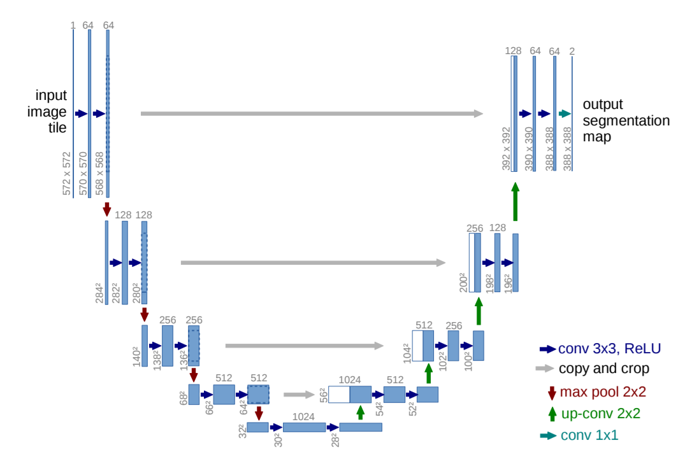
</p>

**[Pyramid Scene Parsing Network - PSPNet](https://arxiv.org/pdf/1612.01105.pdf)**

<p align="center">
    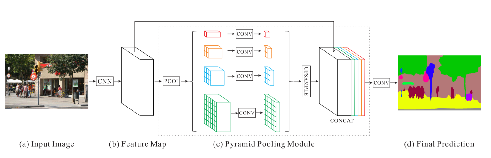
</p>

## Mapping RGB Values in the ground truth to a one-hot encode vector to generate n channel encoded ground truth for training

The ground truths provided are 3 channel RGB images. In the current dataset, there are only 9 unique RGB values in the ground truths as there are 9 classes that are to be classified. These 9 different RGB values are one-hot encoded to generate a 9 channel encoded ground truth with each channel representing a particular class.

Below is the encoding scheme

<p align="center">
    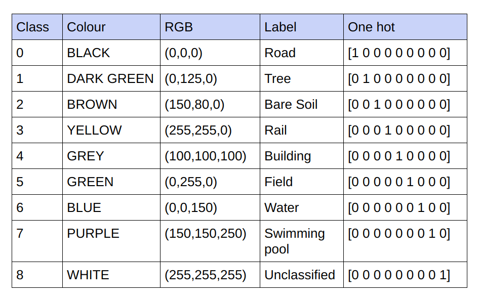
</p>

Realisation of each channel in the encoded ground truth as a class

<p align="center">
    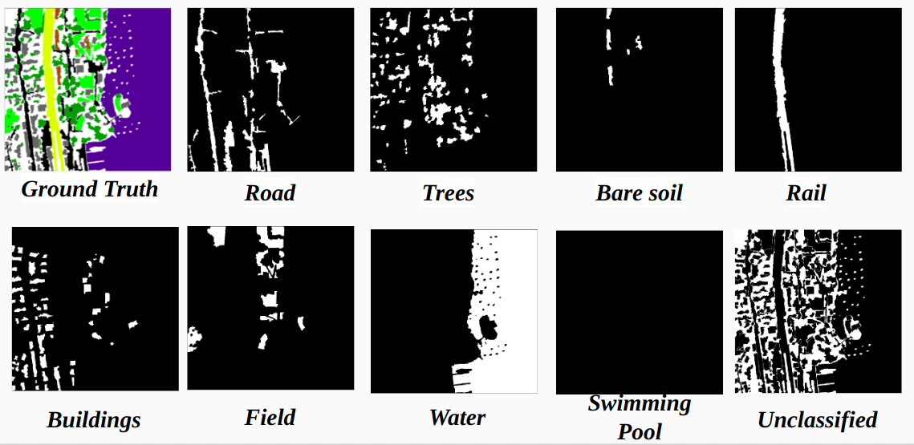
</p>

So instead of training on the RGB values of the ground truth we have converted them into the one-hot values of different classes. This approach yielded us a validation accuracy of 85% and training accuracy of 92% compared to 71% validation accuracy and 65% training accuracy when we were using the RGB ground truth values for training.

This might be due to decrease in variance and mean of the ground truth of training data as it acts as an effective normalization technique. **The better performance of this training technique is also because the model is giving an output with 9 feature maps each map indicating a class, i.e, this training technique is acting as if the model is trained on each of the 9 classes separately for some extent(but here definitely the prediction on one channel which corresponds to a particular class depends on others)**.

### Problems with PSPNet

Our results on PSPNet for Satellite image classification:

Training Accuracy - 49%
Validation Accuracy - 60%

*Reasons:*

- Huge number of parameters (46M trainable params)
- Contains a Resnet which demands more data to learn the features properly.
- Under-fitting - We currently have very less data even after the strided cropping (15k images), so the PSPNet could not learn to segment (classify) the satellite images

### Final Architecture chosen

*U-Net:*

- Has less number of parameters (31M)
- Lesser number of layers than in PSPNet.
- Best suitable for cases where the data is comparatively less, especially in the current case, training on 14 images

*Modified U-Net:*

- Batch Normalization before every downsampling and upsampling layers to decrease the variance and mean of the feature maps.
- Used deconvolution layers instead of conv layers in the upsampling part of the UNet, but the results weren't good

## About the Dataset, Training and Validation split

For training and validation we have used the 14 '.tif' images in the folder [`Inter-IIT-CSRE/The-Eye-in-the-Sky-dataset`](Inter-IIT-CSRE/The-Eye-in-the-Sky-dataset). 

**For training we have used first 13 images in the dataset and for validation, 14th image is used**.

Each satelite images in the folder [`sat`](Inter-IIT-CSRE/The-Eye-in-the-Sky-dataset/sat) contains 4 channels namely R (Band 1),G (Band 2),B (Band 3) and NIR (Band 4).

The ground truth images in [`gt`](Inter-IIT-CSRE/The-Eye-in-the-Sky-dataset/gt) directory are RGB images and depict 8 classes - Roads, Buildings, Trees, Grass, Bare Soil, Water, Railways and Swimming pools

The reason we have considered only one image (14th image) as validation set is because it is one of the smallest images in the dataset and we do not want to leave less data fo training as the dataset is pretty small. The validation set (14th image) we have considered does not have 3 classes (Bare soil, Rail, Swimmimg poll) in it which have pretty high training accuracies. The validation accuracy would have been better if we would have considered a image with all the classes in it(No image in the dataset contains all the classs, there is atleast one class missing in all the images).

### Data Processing during training

**The Strided Cropping:**

To have sufficient training data from the given high definition images cropping is required to train the classifier which has about 31M parameters of our U-Net implementation. The crop size of 64x64 we find under-representation of the individual classes and the geometry and continuity of the objects is lost, decreasing the field of view of the convolutions.

Using a cropping window of 128x128 pixels with a stride of 32 resultant of 15887 training 414 validation images.

**Image Dimensions:**

Before cropping, the dimensions of training images are converted into multiples of stride for convenience during strided cropping.

For the cases where the no. of crops is not the multiple of the image dimensions we initially tried zero padding , we realised that adding padding will add unwanted artefacts in the form of black pixels in training and test images leading to training on false data and image boundary.

Alternatively we have correctly changed the image dimensions by adding extra pixels in the right most side and bottom of the image. So we padded the difference from the left most part of the image to it’s right deficit end and similarly for the top and bottom of the image.

## Results

### Model Predictions Vs Ground truths on some training and Validation images

**Training Example 1: Image '2.tif' from training data**

<p align="center">
    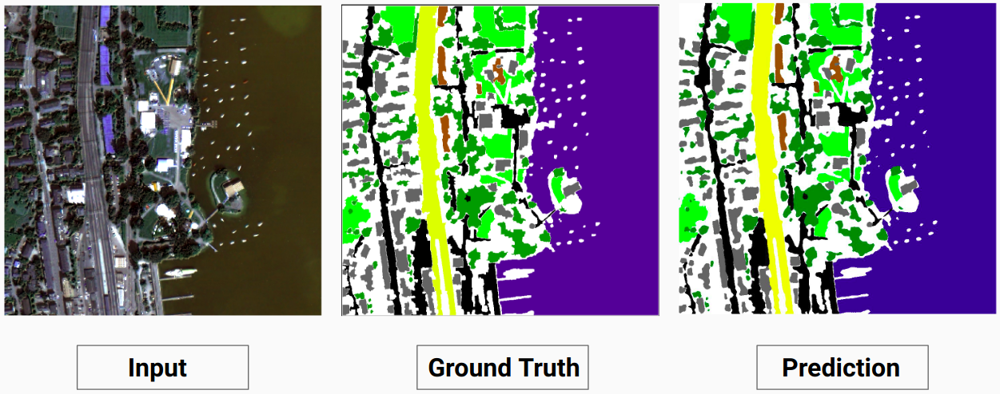
</p>

**Training Example 2: Image '4.tif' from training data**

<p align="center">
    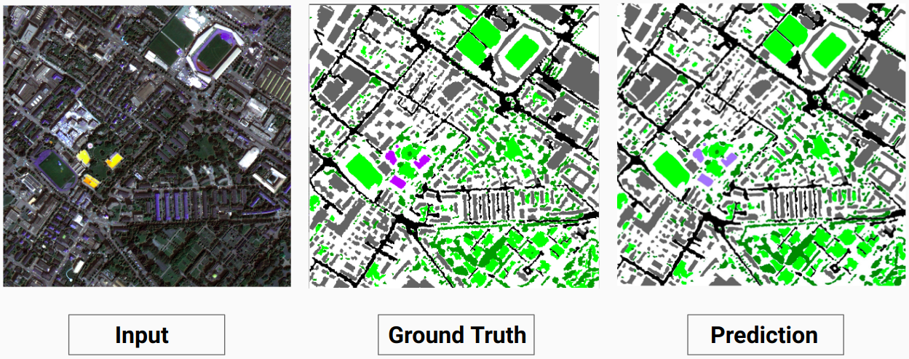
</p>

**Validation Example: Image '14.tif' from dataset**

<p align="center">
    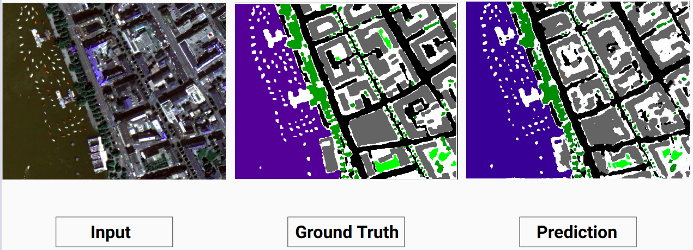
</p>

### An interesting observation

Our model is able to predict some classes which a human annotator wasn't able to. The un-identifiable classes in the images are labeled as white pixels by the human annotator. Our model is able to predict some of these white pixels correctly as some class, but this caused a decrease in the overall accuracy as the white pixels are considered as a seperate class by the model.

Here the model is able to predict the white pixels as a building which is correct and can be clearly seen in the input image

<p align="center">
    
</p>

**Chech out [`Comparison_Test.pdf`](Comparison_Test.pdf) for comparision between test images and their predicted outputs by the model**

<!---### Model Predictions on Testing images (Ground truths not available)--->

<!--- 
<p float="left">
  
   
  
  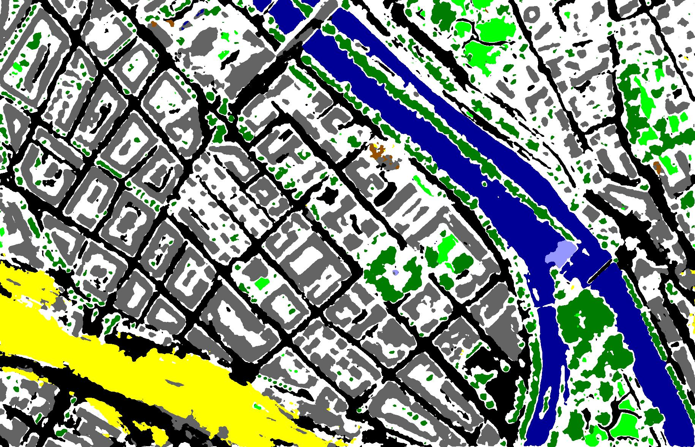
</p>
--->

<!---
<p float="left">
  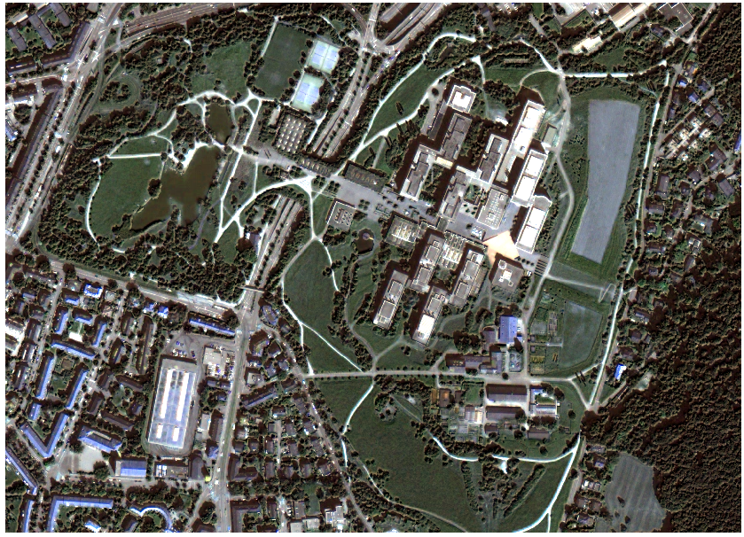
  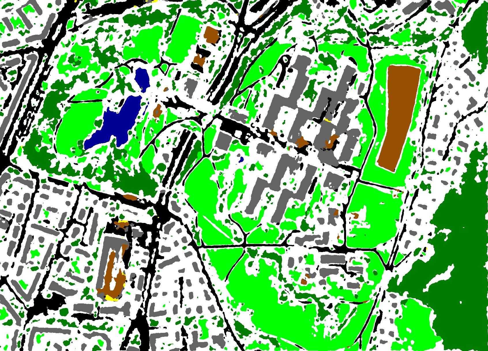
  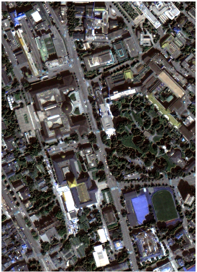
  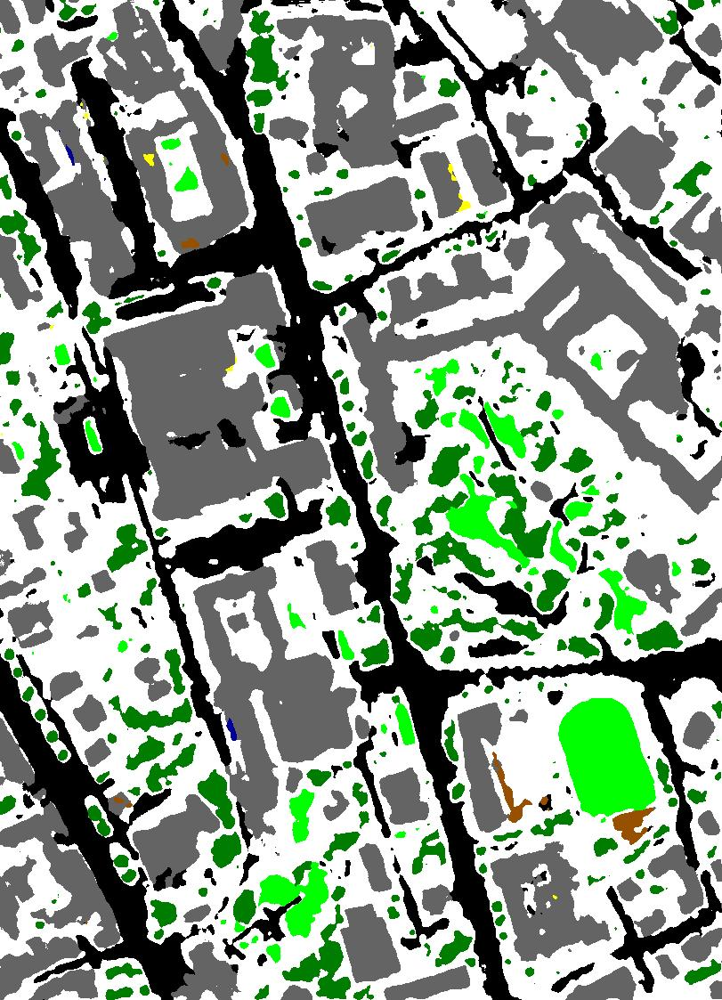 
</p>
--->

<!---
<p float="left">
  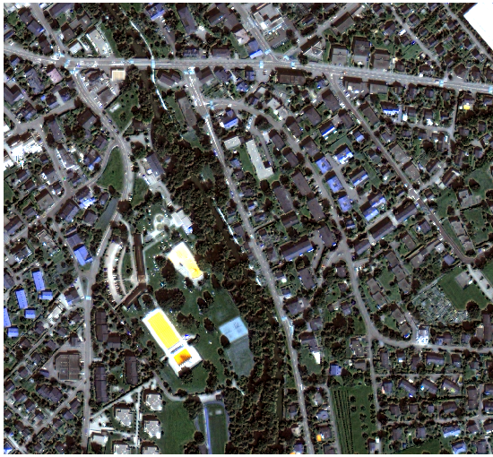
  
  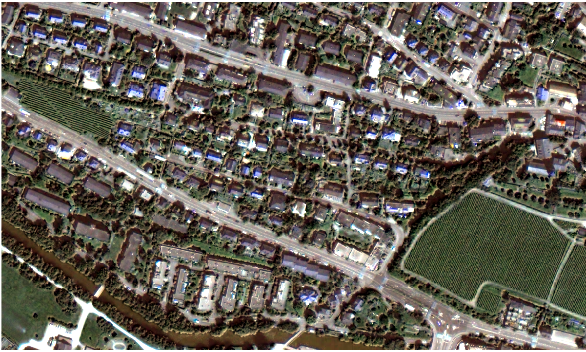
  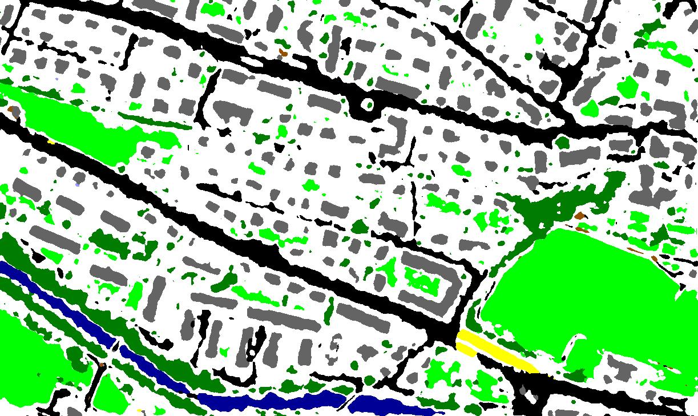
</p> --->

<!---Solarized dark             |  Solarized Ocean
:-------------------------:|:-------------------------:
  |  
  |  
  |  
  |  
  |  
  |  --->

### Accuracy and Loss plots for training and validation

<p align="center">
    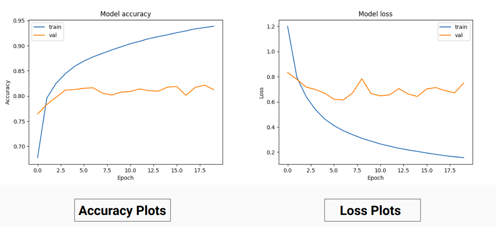
</p>

### Confusion matrices for training

<p align="center">
    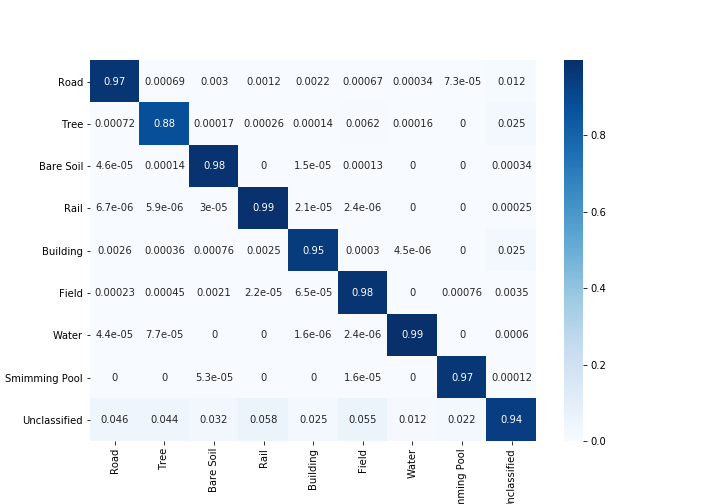
</p>

### Kappa Coefficient

Kappa Coefficients With and Without considering the unclassified pixels

<p align="center">
    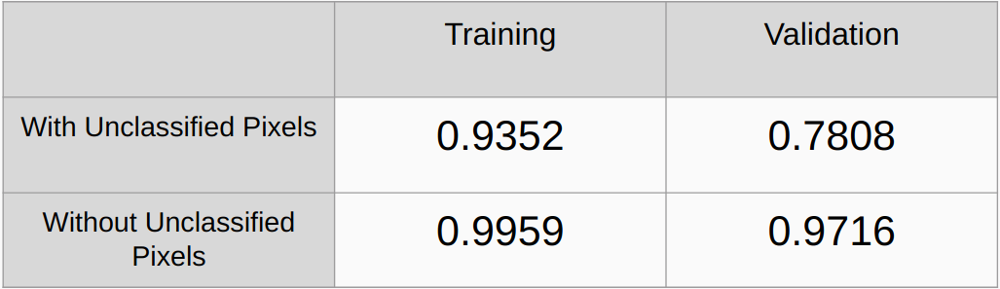
</p>

### Overall Accuracy

Overall Accuracy With and Without considering the unclassified pixels

<p align="center">
    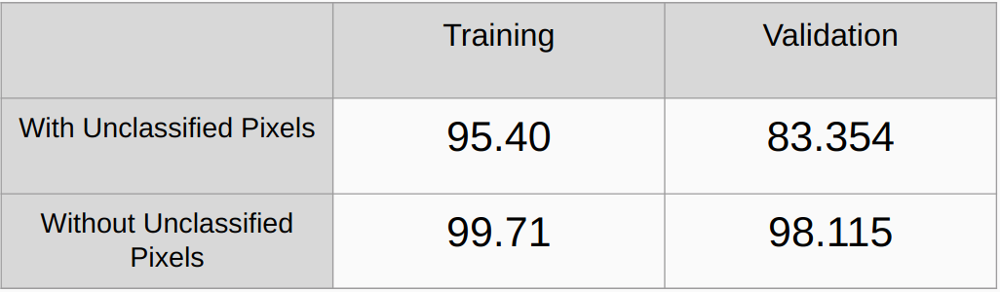
</p>

### Further improvements to be done in the current work

- Need to add regularization methods like L2 regularizarion and droupout and check the performance

- Implement an algorithm to automatically detect all the unique RGB values in the ground truths and onehot encode them instead of manually finding the RGB values.

## References

[1] [U-Net: Convolutional Networks for Biomedical Image Segmentation](https://arxiv.org/pdf/1505.04597.pdf), Olaf Ronneberger, Philipp Fischer, and Thomas Brox

[2] [Pyramid Scene Parsing Network](https://arxiv.org/pdf/1612.01105.pdf), Hengshuang Zhao, Jianping Shi, Xiaojuan Qi, Xiaogang Wang, Jiaya Jia

[3] [A 2017 Guide to Semantic Segmentation with Deep Learning](http://blog.qure.ai/notes/semantic-segmentation-deep-learning-review), Sasank Chilamkurthy
